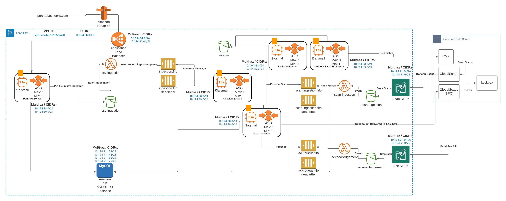

# Setting Up A New Environment
When you need to create a new environment you can copy the folders under `TEMPLATE/us-east-1/template` . These should go under the corresponding
directory structure pertaining to the AWS account, region, and enviroment. For example the following directory structure `DEV/us-east-1/staging/`.  Not only should you copy the directories but your new environment also needs the `env.hcl` file.  This has default settings for your new environment. Make sure you update env.hcl with your correct
settings.

## Recommended Deploy Order
1. Lambdas and dependencies.
  ```bash
$ cp -r TEMPLATE/us-east-1/template/lambda* DEV/us-east-1/staging/
$ cp -r TEMPLATE/us-east-1/template/env.hcl DEV/us-east-1/staging/
$ cp -r TEMPLATE/us-east-1/template/common-tags DEV/us-east-1/staging/
$ cp -r TEMPLATE/us-east-1/template/kms-keys-global DEV/us-east-1/staging/
$ cp -r TEMPLATE/us-east-1/template/s3* DEV/us-east-1/staging/
$ cp -r TEMPLATE/us-east-1/template/sqs* DEV/us-east-1/staging/
$ ls -la
total 8
drwxr-xr-x  14 t450963  staff  448 Mar 23 09:56 .
drwxr-xr-x   6 t450963  staff  192 Mar 22 22:37 ..
drwxr-xr-x   4 t450963  staff  128 Mar 23 08:39 common-tags
-rw-r--r--   1 t450963  staff  373 Mar 22 22:30 env.hcl
drwxr-xr-x   4 t450963  staff  128 Mar 23 08:39 kms-keys-global
drwxr-xr-x   4 t450963  staff  128 Mar 23 08:40 lambda-dpxn-acknowledgement
drwxr-xr-x   4 t450963  staff  128 Mar 23 09:48 lambda-dpxn-csv-ingestion
drwxr-xr-x   4 t450963  staff  128 Mar 23 09:57 lambda-dpxn-scan-ingestion
drwxr-xr-x   4 t450963  staff  128 Mar 23 08:39 s3-dpxn-acknowledgement
drwxr-xr-x   4 t450963  staff  128 Mar 23 09:47 s3-dpxn-csv-ingestion
drwxr-xr-x   4 t450963  staff  128 Mar 23 09:56 s3-dpxn-scan-ingestion
drwxr-xr-x   4 t450963  staff  128 Mar 23 08:39 sqs-dpxn-acknowledgement
drwxr-xr-x   4 t450963  staff  128 Mar 23 09:47 sqs-dpxn-ingestion-queue
drwxr-xr-x   4 t450963  staff  128 Mar 23 09:56 sqs-dpxn-scan-ingestion

# Now You need to deploy each lambda.  Each lambda will pull in its deps.
$ cd DEV/us-east-1/staging/lambda-dpxn-acknowledgement
$ terragrunt apply-all # You can run terragrunt plan-all if you want to see what will be done by the apply .

```


2. RDS
```bash
cp -r TEMPLATE/us-east-1/template/rds-pen DEV/us-east-1/staging/

# Deploy RDS
$ cd DEV/us-east-1/staging/rds-pen
$ terragrunt apply-all
```
3. Deploy EC2 instances
```bash
cp -r TEMPLATE/us-east-1/template/ec2* DEV/us-east-1/staging/

# Deploy EC2 instances.  Go into each ec2 directory and run terragrunt.
$ cd DEV/us-east-1/staging/ec2*
$ terragrunt apply-all
```
4. Deploy SFTP Instances
```bash
cp -r TEMPLATE/us-east-1/template/transfer-sftp-* DEV/us-east-1/staging/

# Deploy SFTP instances.  Go into each of the sftp users directory as they will call their perspective SFTP instance creation.
$ cd DEV/us-east-1/staging/transfer-sft-pen-*-users/
$ terragrunt apply-all
```

At this point you deployed all of your infrastructure and are ready to deploy code and setup the application.  You will have infrastructure that looks like the following diagram.


